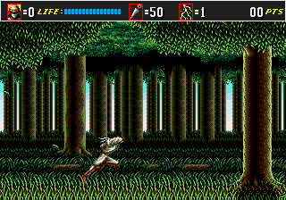

# Fine-Tuning a Video Large Language Model (Vid-LLM) for Automatic Annotation of Gameplay

By Vincent Chamberland & Renaud Dagenais

## Project definition
### Background
Video games provide a controlled and rich environment to observe and modulate human behavior, and have been used in various research fields, such as cognitive neuroscience, psychology, and human-computer interaction. However, analyzing gameplay recordings can be time-consuming and labor-intensive, as it often requires manual annotation of player actions and events, which can be error-prone, subjective, and challenging to scale, especially when dealing with large datasets or complex game dynamics ([Harel et al., 2023](https://osf.io/preprints/psyarxiv/uakq9)).

Recently, a growing number of large language models (LLMs) have been specialized for video understanding (Vid-LLMs), where they can generate detailed descriptions of video content, such as actions, objects, and events ([Tang et al., 2023](https://arxiv.org/abs/2312.17432)). These models can be fine-tuned on specific tasks to improve their performance and adapt them to new domains. For example, a model fine-tuned with sports videos can be used to analyze player performance, develop gameplay strategies, and provide detailed commentary. 

### Aims
Therefore, this project aims to develop a preprocessing pipeline to fine-tune a Vid-LLM for automatic annotation of gameplay recordings in order to reduce manual annotation and increase efficiency.

### Project Objectives
1. Fine-tune an existing video LLM with semi-automatic annotation of video game recordings [train phase]
2. Automatically generate annotations and timestamps on untrained video game recordings [test phase]
3. Validate its precision with various performance metrics

### Brainhack objectives
1. Gain experience with the Gym Retro ecosystem and its Python API for video game analysis
2. Gain experience in manipulation of video data (e.g., conversion, extraction, and processing) 
3. Gain experience with project and version management tools (e.g., Git, DataLad)
4. Gain experience in Python scripting (e.g., dataframes, computer vision, automation)
5. Gain experience with LLM training and testing using video data
6. Gain experience with performance evaluation metrics for video annotation

## Methodology
1. Retrieve all relevant gaming session (i.e., participant runs) from the Courtois NeuroMod repository using DataLad;
2. Utilize the Gym Retro Python API to convert .bk2 files from each run into video format 
3. Preprocess the video data to extract relevant features, such as player actions, movements, and events
4. Associate each event (e.g., jump, attack, dodge, etc.) to a dictionary of detailed descriptions (e.g., "The player jumps over the enemy", "The player attacks the enemy", etc.)
5. Map each event to a corresponding timestamp and frame in the video recording
6. Generate a dataset of annotated gameplay recordings with detailed descriptions and timestamps
7. Train a Vid-LLM on the preprocessed video data to generate annotations and timestamps
8. Validate the Vid-LLM annotations with the manually annotated dataset (e.g., frame to frame comparison)
9. Evaluate the performance of the Vid-LLM using various metrics (accuracy, recall, etc.)

### Dataset
The dataset is provided by the [Courtois NeuroMod project](https://www.cneuromod.ca/). It includes behavioral data recorded during gameplay of the retro video game "Shinobi III - Return of the Ninja Master", specifically capturing the movements and actions taken by three subjects. Each subject participated in four gaming sessions, with each session consisting of approximately a dozen runs. For the purposes of this project, we will focus on a subset of this dataset: analyzing runs from a single participant, specifically those in which they played level 1 of Shinobi [i.e., 89 runs]. We provide a detailed [documentation](doc/how-to-download-raw-data.md) on how to download this dataset.

### Tools
- Python scripting tools & packages
    - Jupyter notebooks
    - Gym Retro’s Python API (RetroEnv)
    - Dataframe handling (e.g., pandas, numpy) 
    - Computer vision (e.g., OpenCV, moviepy)
    - Machine Learning requirements for the Vid-LLM model (pytorch, CUDA, etc.,)
- Project management & versioning
    - Version controlling (Git, Github, Datalad)
- Remote computing environment
    - Compute Canada’s Narval supercomputer cluster

## Deliverables (Week 4 results)
- Cleaned-up event dataset ([dataset](data/datasets))
- Formatted question-answers json file for supervised fine-tuning of the Vid-LLM ([file](data/json_files/custom.json))
- Jupyter notebooks for data preprocessing and exploration:
    - Dataset cleaning ([notebook](notebooks/dataset_preprocessing.ipynb))
    - Generating training videos from all Gym Retro's bk2 files ([notebook](notebooks/training_video_generator.ipynb))
    - Generating custom question-answers json file ([notebook](notebooks/custom_jason_generator.ipynb))
    - Generating short testing videos ([notebook](notebooks/testing_video_generator.ipynb))
    - Generating a single short testing video ([notebook](notebooks/single_testing_video_generator.ipynb))
    - Generating specific frames and gifs from selected videos ([notebook](notebooks/frame_gif_generator.ipynb))
    - Finding specific frames in a video ([notebook](notebooks/frame_finder.ipynb))
- Documentation on the notebooks ([file](doc/notebook_doc.md))
- Examples of training and testing videos, frames and gifs ([directory](output))
- requirements.txt file for the project ([file](requirements.txt))

## Collaborators
* The Pierre/Lune Bellec Lab
* The Courtois NeuroMod Project

## References
- Harel, Y., Pinsard, B., Boyle, J. A., Cyr, A., Clei, M. L., Mignot, P.-H., St-Laurent, M., Jerbi, K. and Bellec, P. (2023). Gamer in the scanner : Event-related analysis of fMRI activity during retro videogame play guided by automated annotations of game content. https://doi.org/10.31234/osf.io/uakq9
- Tang, Y., Bi, J., Xu, S., Song, L., Liang, S., Wang, T., Zhang, D., An, J., Lin, J., Zhu, R., Vosoughi, A., Huang, C., Zhang, Z., Zheng, F., Zhang, J., Luo, P., Luo, J. and Xu, C. (2023). Video Understanding with Large Language Models: A Survey. arXiv. https://doi.org/10.48550/arxiv.2312.17432
